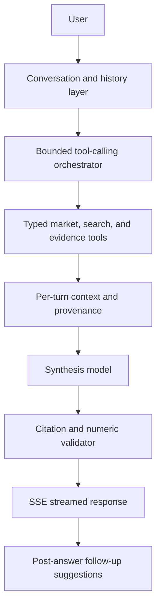
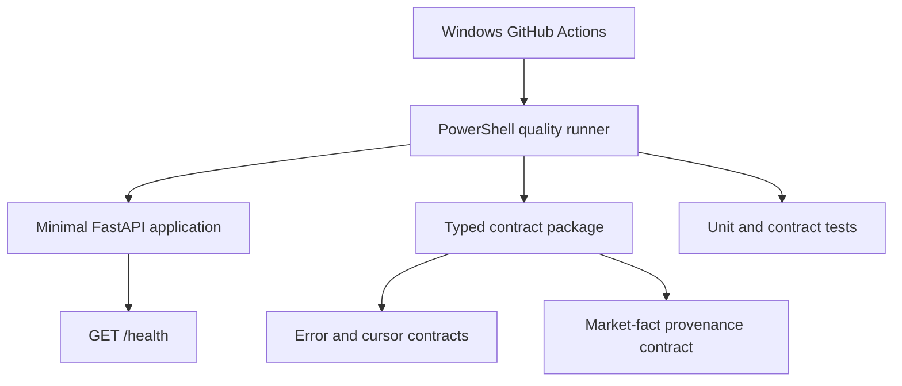
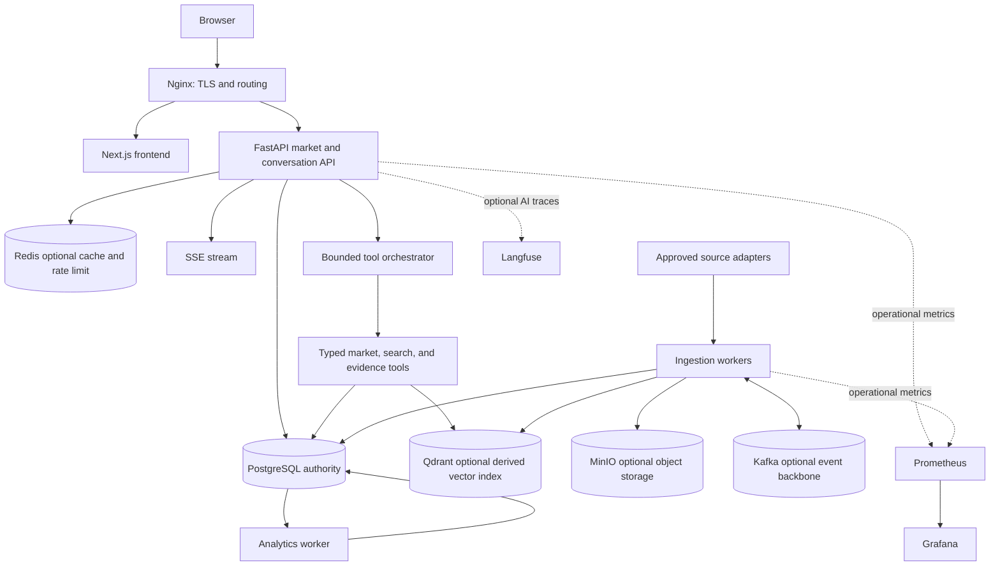

# Tech Market Intelligence: An Evidence-Backed Platform for Skill Demand, Job-Market Analytics, Retrieval, and AI-Assisted Career Research

**Living Technical Paper / Project Research Document**

- **Project status:** M3 Deterministic Analytics and First Useful UI complete pending commit
- **Current phase:** M3 implementation complete pending final verification and commit; PostgreSQL schema, deterministic market API, and first Next.js dashboard exist; no M4+ retrieval, LLM, vector, or event infrastructure
- **Last updated:** 2026-09-25
- **Authority:** approved repository plan, milestone checklist, architecture decisions, and verified M0–M3 artifacts

This document uses three implementation states:

- **Completed:** present and verified in the repository.
- **Planned:** approved but not implemented.
- **Conditional:** considered only if a documented measurement gate is met.

The maintenance policy appears in Section 25 and applies throughout this paper.

## 1. Abstract

Technical labor-market information is distributed across mutable job postings, heterogeneous source systems, and inconsistent terminology. This project investigates how versioned technical job postings can be transformed into reproducible market statistics, skill-demand distributions, role comparisons, temporal trends, job retrieval, and evidence-backed AI-assisted research. The system is designed around deterministic analytics and explicit provenance: authoritative counts, percentages, rankings, and trends must be computed from stored records and traceable to source observations. Language models may support extraction, classification, query and tool routing, retrieval assistance, and synthesis, but they are not accepted as sources of market statistics.

The planned methodology combines a canonical temporal job corpus, a versioned and inspectable skill taxonomy, evaluated extraction pipelines, deterministic metric definitions, staged retrieval benchmarks, and a bounded tool-calling research assistant. Lexical, dense, hybrid, and reranked retrieval will be compared using labeled relevance judgments rather than assumed performance. Prompt repetition, motivated by prior research on non-reasoning language-model inference, is treated as a project-specific hypothesis to test rather than a production default. Development is constrained to a local-first, open-source-first, near-zero-cost environment. Optional profile or resume comparison is secondary personalization, not the core product, and will avoid unjustified match percentages.

M0 through M3 now establish the engineering foundation, canonical temporal corpus, deterministic normalization/extraction baseline, versioned market analytics, paginated read API, and first evidence drill-down UI. Retrieval, grounded AI assistance, live source adapters, trends, private profile comparison, durable workers, and production hardening remain later milestone work.

## 2. Motivation and Problem Statement

Job-market evidence is difficult to use reliably for career decisions. Relevant postings are distributed across employer career sites, applicant-tracking systems, government portals, public datasets, and manual collections. They differ in schema, vocabulary, geographic scope, freshness, and permissions. Postings may change or disappear, leaving no stable basis for later comparison unless observations are retained with time and source metadata.

Terminology creates an additional measurement problem. Employers may use `Postgres`, `PostgreSQL`, or other variants for one technology, while short names such as `R`, `Go`, `Spark`, or `Airflow` can be ambiguous outside context. Role titles are also noisy: two postings called “AI Engineer” may describe different work, and postings with different titles may request similar skills. Therefore, counting raw strings or titles cannot produce defensible role or skill statistics.

Career guidance frequently compounds these data problems. Advice may cite no denominator, cohort, source window, or evidence. A language model can produce plausible percentages without querying any corpus. Resume-matching systems often compress heterogeneous evidence into an unexplained score, such as an “82% match,” even when requirements differ in importance and profile evidence is uncertain. Such outputs are hard to audit and can be mistaken for objective assessments.

Tech Market Intelligence therefore centers market evidence rather than resume matching. Its primary output is a transparent account of what a defined corpus of employers requested, under specified filters and dates. Optional profile comparison will later ask which observed market requirements have support in a user’s own evidence and which do not. It will not claim to predict employability or hiring outcomes.

## 3. Project Objectives

| ID | Objective |
|---|---|
| O1 | Build a canonical, versioned technical-job corpus with deterministic identities, source metadata, and end-to-end provenance. |
| O2 | Build an inspectable, versioned skill taxonomy and an extraction pipeline that can be tested independently of language-model claims. |
| O3 | Produce deterministic market metrics with explicit numerator, denominator, dimensions, cohort, time window, source cutoff, versions, and evidence references. |
| O4 | Support reproducible role, seniority, location, skill-demand, co-occurrence, and temporal comparisons. |
| O5 | Benchmark structured SQL, PostgreSQL lexical search, dense retrieval, hybrid retrieval, and reranking rather than assume semantic search is superior. |
| O6 | Build a bounded AI research assistant whose market answers derive from typed tools and stored evidence, with deterministic numeric and citation validation. |
| O7 | Evaluate extraction, model, routing, and prompting strategies quantitatively on project-specific labeled datasets. |
| O8 | Keep full development reproducible locally at approximately zero infrastructure cost and avoid mandatory paid inference. |
| O9 | Introduce specialized infrastructure only after a documented problem and measured gate justify its operational cost. |
| O10 | Produce a portfolio-quality system demonstrating data engineering, backend, AI engineering, evaluation, security, observability, and operational discipline. |

### 3.1 Non-objectives

The project is not intended to provide applicant tracking, recruiting CRM, job application automation, salary negotiation, or hiring decisions. It will not depend on LinkedIn scraping, mandatory cloud infrastructure, managed Kafka, paid vector databases, persistent GPUs, or paid language-model APIs. It will not claim universal labor-market coverage, causal relationships, or real-time conditions without supporting data. It will not treat LLM-generated quantities as facts, build an opaque employability score, or introduce microservices, multi-agent systems, vector infrastructure, or event streaming for résumé value alone.

## 4. Research and Engineering Questions

| ID | Question | Planned evidence point |
|---|---|---|
| RQ1 | Can deterministic dictionary and rule-based skill extraction provide sufficient precision before LLM extraction is considered? | M2 labeled extraction benchmark |
| RQ2 | How much does dense retrieval improve technical-job relevance over PostgreSQL lexical search? | M4 held-out retrieval evaluation |
| RQ3 | Does hybrid retrieval materially improve NDCG and MRR over lexical or dense retrieval alone? | M4 preregistered promotion gate |
| RQ4 | When is Qdrant operationally justified relative to PostgreSQL and, if evaluated, pgvector? | M4 latency, scale, and isolation measurements |
| RQ5 | Can a bounded tool-calling assistant answer fixed market questions with zero unsupported numeric claims? | M5 deterministic citation and number validation |
| RQ6 | Does full prompt repetition improve project-specific extraction, classification, or routing tasks? | M6 paired prompt-strategy experiments |
| RQ7 | When does Kafka create meaningful value over a PostgreSQL durable work queue and transactional outbox? | M8 queue throughput, lag, replay, and consumer requirements |
| RQ8 | How much specialized infrastructure can remain optional while retaining production-oriented reliability and reproducibility? | M8–M9 resource and failure testing |
| RQ9 | Can source- and cohort-qualified temporal metrics distinguish observed demand changes from changes in collection coverage? | M6 fixed-cohort trend validation |
| RQ10 | Can optional profile comparison remain explainable by linking market requirements and profile evidence without a generic match score? | M7 privacy, extraction, and comparison evaluation |

These questions are falsifiable where practical. A negative result—for example, dense retrieval failing to beat lexical search—will be retained as a project finding and may prevent the associated infrastructure from being introduced.

## 5. Current Knowledge and Design Principles

The approved planning process establishes the following working knowledge and constraints.

1. **PostgreSQL is the initial source of truth.** Planned corpus entities, temporal observations, many-to-many skill relationships, analytics inputs, conversations, and processing state are relational. PostgreSQL supports initial operational and analytical needs without immediately creating cross-store consistency problems.
2. **Raw observations and derived results require versions.** Source pages mutate, parsing rules change, and taxonomy revisions can alter derived facts. An overwritten row cannot explain why an earlier result differed.
3. **A percentage without its denominator is incomplete.** Every market metric must preserve numerator, denominator, unit, dimensions, source cutoff, corpus snapshot, metric version, taxonomy version, coverage warning, and evidence links.
4. **Observed data is cohort-dependent.** Results describe collected sources and filters, not an entire labor market. Geography, employer type, source composition, and collection period constrain interpretation.
5. **Collection growth is not market growth.** More postings in a later period may reflect broader collection rather than increased demand. Trend work requires compatible cohorts and explicit date semantics.
6. **Language-model output is interpretation, not statistical authority.** Models may map, classify, route, or synthesize. Stored records and deterministic computations remain authoritative for numeric claims.
7. **Market facts should resolve to evidence.** The intended chain is metric result to analytics run, corpus snapshot, job snapshots, raw record, and original source.
8. **The project begins as a modular monolith.** One backend codebase and typed in-process boundaries minimize local cost and distributed failure modes. Service extraction requires evidence.
9. **Local-first development is mandatory.** A student must be able to develop and evaluate the system without paid infrastructure.
10. **Infrastructure is introduced by gates, not fashion.** Each optional service must solve a measured problem that simpler components cannot adequately solve.
11. **Abstention is preferable to false certainty.** Ambiguous classification and normalization should retain uncertainty or require review instead of silently becoming market facts.
12. **Evaluation artifacts are versioned project assets.** Dataset manifests, annotation guidance, predictions, model/index settings, and reports are necessary for reproducibility.

## 6. System Scope

### 6.1 Core product

Planned core workflows allow a user to:

- browse technical job-market data by role, seniority, location, source, and period;
- inspect skill distributions with sample sizes and supporting postings;
- compare roles using observed common and distinctive skills;
- inspect temporal trends with explicit cohort and coverage qualifications;
- search jobs through structured, lexical, and—if justified—semantic retrieval;
- drill from a statistic or answer into job snapshots and source evidence; and
- ask an AI research assistant questions that are answered through deterministic market and retrieval tools.

### 6.2 Optional personalization

A later, optional profile workflow may parse a private PDF, DOCX, TXT, or Markdown document into reviewable sections and skill evidence. A user could compare that evidence against a selected market cohort. The intended form is explanatory: a market requirement has a measured prevalence, while profile evidence is present, absent, uncertain, or user-corrected. Profile data must remain separate from market aggregates and deletable according to documented policy.

Profile processing is not the product center, an employability predictor, or a hiring recommendation system.

## 7. Data Model and Provenance

### 7.1 Principal entities

| Entity | Planned role |
|---|---|
| `Source` | Describes origin, adapter, permissions, attribution, rate policy, and review state. |
| `IngestionRun` | Records one bounded import or fetch attempt, versions, timing, status, and failures. |
| `RawRecord` | Immutable source observation with payload/artifact reference, retrieval metadata, and content hash. |
| `Job` | Stable logical posting identity across repeated observations. |
| `JobSnapshot` | Parsed version of a job at a specific observation, with processor versions. |
| `Company` | Canonical employer identity where evidence permits resolution. |
| `Role` | Versioned normalized role classification. |
| `Seniority` | Normalized seniority classification with method and uncertainty. |
| `Location` | Normalized location and remote-work dimensions. |
| `Skill` | Stable canonical skill identity. |
| `SkillAlias` | Versioned spelling, abbreviation, locale, matching mode, case sensitivity, boundary rule, ambiguity status, and curation evidence. |
| `SkillRelationship` | Versioned parent/child edge with a constrained relationship type. |
| `JobSkill` | Evidence linking a snapshot to a skill, including source span, method, confidence, and taxonomy version. |
| `SkillCandidate` | Pending, accepted, or rejected review evidence for an ambiguous extracted mention. |
| `CorpusSnapshot` | Immutable definition of observations included at an analytical cutoff. |
| `SkillSnapshot` | Published aggregate tied to corpus, metric, and taxonomy versions. |
| `Conversation` | Persistent assistant interaction container. |
| `Citation` | Link from an answer claim to stored job or aggregate evidence. |

Optional profile entities include users, profiles, profile documents, sections, skill evidence, comparisons, and deletion requests.

### 7.2 Logical jobs, raw records, and snapshots

A **raw record** is what a source supplied at a retrieval time. It is immutable and identified by source metadata and content hash. A **logical job** is the stable domain identity of a posting, preferably derived from source namespace and immutable source posting ID. A **job snapshot** is one parsed state of that logical posting. If wording, salary, location, or requirements change, the logical job remains while a new snapshot is added.

This distinction supports idempotency, correction, replacement, reprocessing, historical analysis, parser upgrades, and auditability. It also avoids falsely counting every observed revision as a separate job.

### 7.3 Provenance chain


M3 now implements this market-fact chain. Alembic revision `0003_m3_analytics` persists metric definitions, immutable exact-membership corpus snapshots, analytics runs, materialized statistics, coverage warnings, exact evidence snapshot IDs, and metric/taxonomy/normalization/extraction versions. Versioned FastAPI read endpoints resolve published statistics to supporting job snapshots and raw-record hashes, and the Next.js UI exposes that evidence path without treating model output as statistical authority.

## 8. Data-Source Strategy

The source strategy proceeds from controlled and permission-clear inputs toward more operationally complex sources.

1. **Synthetic and license-safe fixtures.** Initial M1 fixtures will test malformed records, edits, missing fields, and duplicates. They validate behavior but cannot support public market claims.
2. **Licensed public datasets.** A dataset is acceptable only with explicit license, publisher, version, provenance, geography, collection method, and permitted use. Hosting on a public repository does not establish rights.
3. **Official ATS APIs.** Selected Greenhouse Job Board and Lever Postings endpoints are planned candidates for current public postings after current terms and employer usage are reviewed. Their current-only nature means local observations would create project history.
4. **USAJOBS.** Its current and historical federal postings may support structured ingestion and temporal research, but must remain a clearly labeled federal cohort rather than a proxy for private technical hiring.
5. **Manual import or paste.** Curated CSV, JSON, or text may fill coverage gaps if the contributor records source, permission basis, observed date, and attribution.
6. **Site-specific or Common Crawl research.** Such work is conditional on source-specific terms and legal review and is not a foundational data path.

A planned source registry records ownership, adapter/version, terms URL and review date, permission status, license, allowed storage and display, attribution, rate policy, geography, fields, history support, checkpoint, freshness objective, and takedown contact. External responses are untrusted and require schema validation. Undocumented request capacity is not interpreted as unlimited.

Closure semantics must guard against data-collection failure. A posting missing from a partial or failed poll cannot be marked closed. Closure becomes a candidate only after complete source enumeration and should require two complete polls or a source-specific grace period. Unexpected mass disappearance should halt automatic closure and require review. Schema drift must produce visible adapter failures rather than silent field loss.

LinkedIn scraping is not foundational because permission, stability, anti-automation controls, and reproducibility make it unsuitable as a required source.

No network source adapter or source access is currently implemented.

## 9. Skill Intelligence Methodology

### 9.1 Planned extraction cascade


The deterministic dictionary and rules form a high-precision baseline. Optional model stages address residual mentions or candidate ranking only after baseline measurement. A model cannot silently create authoritative taxonomy entries.

A skill has a stable ID, canonical label, category, lifecycle status, and taxonomy version. Aliases preserve locale, normalized form, matching mode, case sensitivity, token-boundary rules, ambiguity status, and curation evidence. Parent-child relationships do not collapse distinct technologies: the implemented `PART_OF` edge keeps Amazon EC2 as a child of AWS rather than treating it as a spelling variant.

Every accepted job-skill association retains source span, extraction method, confidence or review state, processor version, and taxonomy version. Ambiguous short aliases abstain from accepted evidence and enter the persisted `skill_candidates` review path with source span, reason, status, extractor version, snapshot, normalization, and taxonomy references. New skills require examples and human or deterministic acceptance criteria.

### 9.2 Evaluation

The labeled benchmark should be stratified by role, seniority, source, language, formatting, and known hard negatives. It should measure exact-span and canonical-skill precision, recall, and F1; role and seniority classification should report accuracy, macro F1, and per-class precision and recall. Cohort-level error analysis is required because a strong aggregate can hide failures on a smaller role, source, or language. Taxonomy changes trigger regression testing against a held-out set.

## 10. Search and Retrieval Methodology

Retrieval is planned as a sequence of evaluated baselines:

```text
structured SQL filters
    → PostgreSQL full-text lexical retrieval
    → dense retrieval
    → hybrid lexical+dense retrieval
    → reranking
```

Structured search establishes correct metadata filtering and stable keyset pagination. PostgreSQL full-text search then provides a lexical baseline over weighted title, canonical skills, company, and description fields. Dense embeddings are evaluated only after a gold query set exists. Hybrid retrieval is expected to use a transparent rank-fusion method such as reciprocal-rank fusion. Reranking is last because it adds latency and model complexity.

### 10.1 Evaluation measures

- Recall@5 and Recall@10
- Precision@5
- Mean Reciprocal Rank (MRR)
- Normalized Discounted Cumulative Gain at 10 (NDCG@10)
- zero-result rate
- p50 and p95 latency
- CPU and RAM use
- index size
- index build time

The initial relevance set is planned to contain at least 50 queries and grow beyond 150, with exact technology queries, conceptual role queries, constraints, abbreviations, and hard negatives. Tuning and held-out test queries must be separated.

The initial preregistered promotion rule in the approved plan requires either at least 0.03 absolute NDCG@10 improvement or at least 10% relative MRR improvement, no more than 0.02 Recall@10 loss, and p95 latency no greater than 1.5 times the current default. These are planned decision thresholds, not measured results.

### 10.2 Qdrant gate

Qdrant is not guaranteed to enter the system. It becomes a candidate only after dense retrieval demonstrates user value and at least one problem remains after PostgreSQL tuning: vector-search p95 above approximately 500 ms under representative load, roughly one to five million vectors, vector maintenance harming transactional workloads, or materially simpler filtered hybrid search, collection isolation, or independent scaling. PostgreSQL remains authoritative; a vector index must be versioned and rebuildable.

## 11. AI Research Assistant

### 11.1 Planned flow



The first useful tools are planned to search jobs, retrieve a job, calculate skill distributions and trends, compare roles, retrieve skill co-occurrence and location statistics, and resolve job evidence. Tools—not the model—query the database and compute market facts. Each output should include bounded rows, continuation information, warnings, denominators where applicable, and provenance.

The orchestrator receives the current request, bounded relevant history, current turn transcript, prior tool results, and tool schemas. The default limit is three tool rounds, supplemented by explicit wall-time, row, call, and token budgets. Calls are keyed by canonical tool name, normalized arguments, and corpus snapshot so an identical expensive call can be reused during one turn.

The agent has no arbitrary SQL capability. Server-side tool implementations enforce validation and future authorization. The synthesis response distinguishes **data fact**, **interpretation**, and **general knowledge**. A deterministic validator checks that citation IDs exist and numeric claims match tool output. Status, tool-use, answer-token, and completion events are intended to stream using Server-Sent Events; suggestions run only after the answer is complete.

A multi-agent design is postponed. It becomes a candidate only if the single-orchestrator baseline shows persistent tool-selection or context interference and specialized agents improve tool accuracy and groundedness enough to justify additional latency and operational complexity.

## 12. Prompt Repetition Research

Leviathan, Kalman, and Matias investigate repeating the complete input prompt for non-reasoning language-model inference in *Prompt Repetition Improves Non-Reasoning LLMs* (arXiv:2512.14982v1). Their results motivate a hypothesis; they do not establish that repetition improves this project’s tasks, models, prompts, or operational constraints.

### 12.1 Working hypothesis

Complete prompt repetition may improve bounded, schema-constrained, low-reasoning tasks such as role classification, seniority classification, location normalization, residual skill extraction, structured metadata extraction, query-intent classification, and tool routing. Long RAG contexts, multi-document synthesis, iterative agent planning, reasoning-enabled prompts, and prompts near context limits are poor default candidates because repeated prefill can increase resource cost or displace useful context.

### 12.2 Planned experiment

Compare paired runs of:

1. `baseline`: complete query once;
2. `repeat_x2`: complete effective query twice;
3. `repeat_x3`: complete effective query three times; and
4. `reasoning`: task-specific reasoning mode where available and justified.

Prompt content, examples, output schema, provider/model revision, decoding settings, and test set should remain fixed across a comparison. Full-query repetition is required for a faithful test of the paper’s method. Repeating only selected prompt sections is a distinct project experiment.

Expected measures include accuracy, macro F1, precision, recall, F1, schema validity, omission and hallucination rates, tool and argument accuracy, unnecessary-tool rate, p50/p95 latency, input tokens, output tokens, failures, local CPU/RAM, and estimated cost. Short, medium, and long inputs should be reported separately.

Before observing held-out results, each task registers a promotion threshold. The approved starting rule for classification and extraction requires a statistically supported improvement of at least 1.0 absolute macro-F1 point or 20% error reduction, no cohort slice losing more than two points, and p95 latency and input-token use no greater than twice baseline. Tool routing must not increase unnecessary calls.

Prompt repetition remains disabled in production unless project-specific evidence meets the preregistered quality and operational gate.

## 13. Current Architecture

### 13.1 Architecture after M0



The repository contains a FastAPI application factory and health endpoint, environment validation, Pydantic API and provenance schemas, unit and contract tests, a PowerShell task runner, exact Python dependency locks, Node runtime pins, accepted ADRs, CI, a PostgreSQL schema through Alembic revision `0003_m3_analytics`, a deterministic versioned market analytics API, and a first Next.js dashboard with evidence drill-down. It contains no M4+ retrieval index, LLM or vector infrastructure, event streaming, external source adapter, or model call.

## 14. Long-Term Target Architecture



This diagram is a north star, not a bill of materials. PostgreSQL, FastAPI, and eventual UI capabilities have approved roles. Every specialized component remains conditional on the introduction gates below. A final system may legitimately omit Qdrant, Kafka, Redis, MinIO, specialized agents, reranking, or a separate analytical store if simpler components satisfy measured needs.

## 15. Infrastructure Introduction Gates

| Candidate | Problem it could solve | Why deferred | Introduction signal |
|---|---|---|---|
| Qdrant | Specialized filtered vector/hybrid retrieval and independent vector scaling | Creates second indexed store, synchronization, backup, tombstone, and rebuild duties | Dense retrieval proves value and tuned PostgreSQL remains above latency/scale/isolation gate described in Section 10 |
| Kafka | Durable multi-consumer event history, replay, high-throughput independent processing | High local resource and operational cost; at-least-once semantics still require idempotency | PostgreSQL queue repeatedly misses freshness, creates DB pressure, reaches sustained high event rates, or three or more consumers need replay |
| Redis | Shared low-latency cache, distributed rate limiting, short-lived coordination | Cache invalidation and another failure mode are unjustified before measured hot reads or multiple instances | Repeated reads consume roughly 20–30% of DB capacity with expected hit rate above 80%, or coordinated multi-instance limiting is required |
| MinIO | Shared S3-compatible object storage, presigned URLs, object lifecycle | Local filesystem is simpler on one node; object/DB consistency adds work | Multiple nodes need shared blobs, volume approaches roughly 100 GB, or presigned access/lifecycle/backup objectives require object semantics |
| Langfuse | Prompt, model, tool, retrieval, token, latency, and evaluation traces | No meaningful LLM workload exists before assistant milestone; traces can contain sensitive text | M5 introduces real assistant calls; deployment remains optional with local/no-op mode and redaction |
| Prometheus | Worker, queue, API, search, embedding, and database operational metrics | Metrics without workloads or decisions create maintenance without evidence | Durable workers and operational SLOs create concrete latency, error, retry, and lag questions; exact milestone timing must remain aligned with roadmap |
| Grafana | Dashboards and alerts over established metrics | Decorative dashboards provide no value before stable metrics and SLOs | Prometheus metrics and operator questions exist, generally at M9 |
| Multi-agent architecture | Prompt/context specialization or ownership isolation | Adds calls, state, latency, and failure modes without a demonstrated baseline problem | Separate agents beat one orchestrator on tool accuracy and groundedness at acceptable latency/cost |
| Reranking | Improved ordering after candidate retrieval | Adds model latency and compute | Hybrid baseline exists and held-out NDCG/MRR improvement passes the registered retrieval gate |
| Separate OLAP store | High-volume multidimensional scans and isolated analytical workload | Creates metric reconciliation and additional operations | Tuned PostgreSQL analytics remains above approximately two seconds and causes sustained CPU/contention under representative load |

Thresholds are initial planning gates, not observed project results. An introduction decision requires an ADR, reproducible benchmark, consistency model, operational ownership, and rollback or exit plan.

## 16. Evaluation Methodology

### 15.1 Ingestion

M1 fixtures will include valid records, malformed inputs, exact duplicates, changed records, partial failures, and replay. Evaluation measures parse success, field accuracy, duplicate decisions, deterministic identity, idempotency, retry recovery, and provenance completeness. Importing the same source content and processor version twice should not create duplicate logical jobs. Changed content should create a new snapshot rather than overwrite history.

### 15.2 Normalization and classification

Role, seniority, and location datasets require human-labeled, stratified examples. Report accuracy, macro F1, per-class precision and recall, abstention coverage, and confusion patterns. Macro metrics are necessary because dominant classes can hide failure on less frequent roles.

### 15.3 Skill extraction

Evaluate exact spans and canonical IDs separately. Report precision, recall, F1, schema validity for model-assisted stages, ambiguity errors, and results by source, role, seniority, language, and format. Compare every optional model stage with the deterministic dictionary/rule baseline.

### 15.4 Analytics

Use a small hand-calculated golden corpus. Validate exact numerators and denominators, deduplicated job selection, source cutoff behavior, period boundaries, null handling, ties, late arrivals, taxonomy versions, and reproducible result hashes. A model judge has no role in verifying arithmetic.

For skill prevalence in cohort \(C\), a basic metric can be written as:

\[
P(s \mid C) = \frac{|\{j \in C : s \text{ is accepted evidence for } j\}|}{|C|}
\]

The stored result must retain both cardinalities, not only \(P\).

### 15.5 Retrieval

Use graded query-document judgments and separated tuning/test sets. Compare Recall@5, Recall@10, Precision@5, MRR, NDCG@10, zero-result rate, latency, resources, index size, and build time. Record corpus snapshot, model revision, dimensions, chunking, and index settings so a report can be reproduced.

### 15.6 Agent and tools

Map natural-language questions to expected tools and argument constraints. Measure tool-selection accuracy, argument accuracy, unnecessary-tool rate, repeated-call avoidance, budget violations, and failure recovery. Fixed tool outputs allow deterministic answer regression tests.

### 15.7 Answers

Evaluate citation existence, citation entailment and coverage, unsupported claims, numeric consistency with tool output, groundedness, relevance, and separation of fact from interpretation. The strongest initial release gate is zero unsupported numeric claims on a fixed regression set.

### 15.8 Prompt experiments

Report quality and operational outcomes together. A quality improvement that doubles token input or materially worsens p95 latency may not be practical. Use paired examples, bootstrap confidence intervals, and McNemar’s test for paired classification correctness where appropriate.

### 15.9 Role of LLM-as-a-judge

An LLM judge may supplement human review for exploratory relevance or answer quality, but it cannot be the only evaluator. It may share model biases, fail to verify citations, or reward fluent unsupported text. Deterministic checks, labeled examples, exact arithmetic, retrieval judgments, and human adjudication remain primary evidence.

## 17. Milestone Methodology

| Milestone | Research/engineering purpose | Expected artifact | Principal evaluation | Infrastructure introduced | Intentionally deferred |
|---|---|---|---|---|---|
| M0 — Foundation and executable contracts | Establish reproducible engineering contract and stable boundaries | Monorepo foundation, contracts, tests, CI, ADRs | Format, lint, strict types, eight tests, wheel build | FastAPI scaffold and local tooling only | All market data and specialized services |
| M1 — Canonical corpus ingestion | Prove temporal identity, provenance, idempotency, and replay | License-safe CSV/JSON import into canonical raw/job/snapshot model | Parsing, duplicate replay, changed snapshots, recovery, throughput/memory | PostgreSQL and synchronous CLI/file pipeline | Network sources, taxonomy, analytics, Kafka |
| M2 — Skill, role, seniority, and location normalization | Establish inspectable deterministic baselines | Versioned taxonomy, spans, rules, labels, abstention | Accuracy, macro F1, precision, recall, F1 by cohort | Same modular backend and PostgreSQL | Production LLM extraction, trends, vectors |
| M3 — Deterministic market analytics and first useful UI | Publish first evidence-backed market experience | Metric registry, corpus snapshots, aggregates, read API, minimal Next.js UI | Exact golden-corpus metrics, query latency, evidence drill-down | Next.js and materialized PostgreSQL analytics | AI assistant, real-time trends, profiles |
| M4 — Search and retrieval evaluation | Select retrieval architecture from evidence | SQL/FTS baseline, relevance set, dense/hybrid experiments, optional reranker report | Recall@K, MRR, NDCG, latency, resources | Embedding/index abstraction; Qdrant only if gate passes | Assumed semantic superiority |
| M5 — Grounded AI research assistant | Test evidence-backed tool use and synthesis | Typed tools, conversation history, bounded loop, SSE, validation | Tool/argument accuracy, unsupported claims, citations, latency/tokens | Provider abstraction, SSE, optional Langfuse | Multi-agent autonomy and arbitrary SQL |
| M6 — Trends, live source adapters, and prompt experiments | Test temporal claims, incremental sources, and repetition hypothesis | One approved ATS adapter, trend views, prompt benchmark report | Freshness, stable cohorts, paired prompt quality/cost | Network adapter under source policy | Broad scraping, unconditional repetition, Kafka |
| M7 — Optional private profile comparison | Add explainable personalization under privacy constraints | Safe document extraction, reviewable evidence, cohort comparison, deletion | Parse success, skill evidence precision/recall, isolation, deletion | Authentication/ownership and filesystem blob abstraction first | Public resumes, generic match score, unproven OCR |
| M8 — Durable asynchronous processing and event decision | Make long-running work restart-safe and test event need | PostgreSQL work queue, worker, outbox/inbox, progress recovery | Crash, duplicate delivery, poison work, queue lag, worker scaling | Worker process; Kafka only if gate passes | Exactly-once claims and Kafka for appearance |
| M9 — Operations, hardening, and portfolio deployment | Demonstrate reproducibility and failure-aware public operation | Compose profiles, metrics, dashboards, runbooks, read-only demo | SLOs, load, clean-machine setup, restore, rollback, degraded mode | Prometheus, Grafana, Nginx; accepted optional stores only | Paid HA, Kubernetes, global scale |

Milestone names follow the approved plan. Later milestones remain planned; this table does not assert their completion.

## 18. Current Project Status

M0 Foundation is completed in the current working tree. Existing artifacts include:

- a minimal monorepo structure;
- Python 3.12.10 and Node.js 22.22.0 pins;
- exact direct Python dependencies and a transitive SHA-256 hash lock;
- a PowerShell task runner for format, lint, strict type check, tests, wheel build, and combined CI;
- a minimal FastAPI application factory with `GET /health`;
- validated local/test/production configuration and secret-aware optional provider key handling;
- typed structured-error, cursor-page, evidence-reference, and market-fact provenance contracts;
- eight unit and contract tests covering configuration defaults, validation secrecy, secret representation, contract shapes, provenance validation, and API health;
- a Windows GitHub Actions workflow without service containers;
- ADR-001, **Modular Monolith First**;
- ADR-002, **PostgreSQL as Initial Source of Truth**;
- architecture, engineering-contract, Definition of Done, configuration, and secret-handling documentation.

M1 verification against PostgreSQL 16.4 completed on 2026-09-21. An empty database migrated to Alembic revision `0001_m1_corpus`, producing source, permission, ingestion-run, raw-record, job, snapshot, processing-attempt, and processing-failure tables. Fourteen non-integration tests and two PostgreSQL integration tests passed. The integration scenarios verified CSV import and identical replay, JSON changed-content import and identical replay behavior through the shared idempotent pipeline, stable logical job identity, additive snapshots, terminal partial-failure persistence, retryable transient-failure persistence and replay recovery, and equivalent provenance lookup by Job ID and JobSnapshot ID. The fixture sequence produced four logical jobs, five raw records, five snapshots, and two terminal failures; the first CSV import reported four accepted records, one duplicate, and one failure, its replay reported four accepted records, four duplicates, and one failure, and changed JSON reported two accepted records with no duplicates or failures.

Measured ingestion on separate empty migrated databases accepted all records without duplicates or failures. The 1,000-record workload completed in 25.8627 seconds at 38.6658 records/second with 2,123,734 bytes peak traced Python memory. The 10,000-record workload completed in 278.8079 seconds at 35.8670 records/second with 12,964,472 bytes peak traced Python memory. Results are machine-specific; `tracemalloc` excludes PostgreSQL server memory and does not characterize cold/warm cache behavior. Ruff format and lint checks, strict mypy, wheel build, migration/schema verification, and Git whitespace validation passed. Known warnings are Starlette/AnyIO and Alembic configuration deprecations. Automated backoff/scheduling is intentionally absent; M1 verifies retryable classification plus explicit replay recovery.

### Verified M2 findings

M2 extends the modular backend and PostgreSQL schema rather than introducing another service. Migration revision `0002_m2_normalization` adds versioned taxonomy and snapshot-bound normalization/extraction persistence while retaining M1 corpus history. The implemented resource versions are `skills-2026-09-22`, `normalization-2026-09-01`, and `extraction-2026-09-22`. Taxonomy publication uses a deterministic manifest hash and rejects different content under an existing version. Derived outputs bind to immutable job snapshots and retain processor, normalization, extraction, and taxonomy versions; accepted skill evidence retains source field and half-open Unicode code-point offsets. Historical outputs are additive and are not silently rewritten.

Deterministic code is authoritative for normalization and extraction. Role, seniority, and location normalization return matched, ambiguous, or unknown states and can abstain instead of forcing a label. Skill extraction uses the checked-in canonical alias catalog, boundary-aware deterministic matching, canonical skill IDs, and exact evidence offsets. No model participates in these results. Current taxonomy version `skills-2026-09-01` contains exactly 31 canonical skills and 44 distinct aliases, with locale, matching mode, case-sensitivity, boundary, ambiguity, and curation metadata. Its manifest hash is `04d9fe6870cc20d03e77ed4c95aa5b8222478882581e8795f429fd9dff5a09b3`. The versioned `skill_relationships` table persists the reviewed AWS-to-Amazon EC2 `PART_OF` edge. Ambiguous short aliases enter the versioned `skill_candidates` table as pending review evidence. Precompiled boundary-aware patterns classify ordinary aliases as `alias` and reviewed punctuation-sensitive forms as `regex`, and persisted evidence retains that method.

Evaluation uses corpus version `1.2.0`: 24 synthetic, manually annotated English examples released as CC0-1.0. Canonical-skill micro results are TP 71, FP 4, FN 0, precision 0.9466666667, recall 1, F1 0.9726027397, and macro F1 0.9444444444. Exact-span micro results are TP 75, FP 4, FN 0, precision 75/79 (0.9493670886), recall 1, and F1 0.9740259740. Role classification achieved accuracy 1, macro F1 1, and abstention rate 0.25. Seniority achieved accuracy 0.8333333333, macro F1 0.8518518519, and abstention rate 0.2916666667. Location achieved accuracy 1, macro F1 1, and abstention rate 0.25.

Observed failure modes are concrete rather than hypothetical. Four hard-negative contextual mentions produce both canonical-skill and exact-span false positives. Seniority produces three false `manager` labels from the word “Manager” in unsupported product-manager titles and maps one expected `lead` case to `manager`. The benchmark is small, synthetic, English-only, and not representative of production distributions; alias matching is not contextual semantic extraction, and offsets use Unicode code-point indexes within each source field. Perfect role and location scores on this corpus do not establish production accuracy.

Current verification passed 66 non-integration tests, 9 PostgreSQL integration tests, and 6 evaluation-suite tests. The full integration suite ran against the isolated `tech_market_test` database. A fresh database migrated to Alembic head `0002_m2_normalization`, and migration verification confirmed M1 tables and behavior remain preserved alongside M2 additions. These results establish repository behavior on the verified fixture and test scope only; they do not establish live-source, multilingual, production-scale, or externally adjudicated quality.

### M3 findings and handoff evidence

M3 extends PostgreSQL with revision `0003_m3_analytics`. The schema adds versioned metric definitions, immutable corpus snapshots and exact job/snapshot membership, analytics-run provenance, and materialized market statistics. Published statistics retain value, numerator, denominator, unit, dimensions, source cutoff through the corpus snapshot, metric/taxonomy/normalization/extraction versions, coverage warning, evidence snapshot IDs, and metric-specific metadata. The publication version is `m3-market-1.0.0`; metric versions are `skill-prevalence-1.0.0`, `role-comparison-1.0.0`, `location-distribution-1.0.0`, and `skill-cooccurrence-1.0.0`. Samples below ten logical jobs receive an explicit small-sample warning.

The checked-in golden corpus is version `m3-golden-1.0.0` under CC0-1.0. Its deterministic cutoff selects `snap-a`, `snap-b`, and `snap-z`, excluding both a superseded observation and a future observation while resolving an equal-time tie by greatest snapshot ID. Corpus membership remains authoritative for every cohort denominator: a member without a compatible succeeded/partial normalization remains one explicit unknown/unresolved job rather than disappearing. Compatible normalizations select greatest `created_at`, then greatest normalization ID. Hand-calculated expectations are Python prevalence 3/3, PostgreSQL prevalence 2/3, and Python/PostgreSQL co-occurrence 2/3. Duplicate skills within one logical job count once, and unknown role/location/work-arrangement values remain explicit rather than being silently imputed.

The PostgreSQL synthetic engineering report records six logical jobs and a successful publication with corpus snapshot `cc4eaf2a-e0d3-5cdd-84b5-ccc295c4dfe5`, membership hash `cb068503a0f632ddfc37d94c84faedab5c2848de1b080a696f165ed8aaba3241`, analytics run `35ac794a-4aef-57a9-af18-987d1db69484`, and result hash `94453f1543d1bc868fbf0d8f9d5451b71e1e694ca6a26e28b35a6d663b3229e8`. On the recorded Windows 11 / Python 3.12.10 machine with 24 logical CPUs and about 33.4 GB RAM, 30 warm runs measured p50/p95 latencies of 0.9676/1.4593 ms for corpus membership, 0.9837/1.4538 ms for skill statistics, and 1.0494/1.5081 ms for corpus-scoped evidence lookup. The report renders backend-engineer and data-engineer role-comparison numerators and denominators separately. The corpus is synthetic and tiny, so these timings validate the local path rather than establish production capacity.

The read surface is versioned under `/api/v1`: market statistics are paginated and ranked by descending value with deterministic UUID tie-breaks, jobs are paginated within an immutable corpus snapshot, and evidence lookup requires the same corpus snapshot and returns the job snapshot, escaped description text, safe HTTP(S) source URL when available, and raw-record hash. Foreign-corpus evidence IDs and cursors return not-found. A published run freezes every selected normalization ID, status, method, processor version, normalized dimensions, skills, and observed timestamp; this full canonical input and all semantic statistic fields participate in deterministic input/result hashes. Cutoffs require timezone-aware values and canonicalize to UTC. Role comparison requires its exact published distinct left/right role pair and statistics expose separate cohort numerators and denominators in metadata; role pagination retains the pair and invalid selection receives an explicit UI state. Jobs and statistic evidence links carry corpus scope. The dashboard also exposes cutoff, metric version, coverage warning, evidence links, explicit empty/error states, and the qualification that observed results describe collected sources rather than the whole labor market.

Current M3 host verification records passing Ruff format/lint, strict mypy, Git whitespace validation, 88 Python non-integration tests (including 6 evaluation tests), 23 isolated PostgreSQL integration tests, 19 Vitest UI tests, TypeScript checking, ESLint, Python wheel, and a production Next.js build. Fresh isolated empty-to-head and seeded M2-to-M3 databases reached Alembic head `0003_m3_analytics` while preserving representative M2 rows. The regenerated engineering report records synthetic ingestion, frozen selected-normalization input, exact persisted-value result hashes, known provenance-version enforcement, explicit backend-engineer/data-engineer publication, corpus-scoped evidence resolution and benchmark query, query-plan capture, and 30-run nearest-rank p95 measurements. The corrected deterministic selection and scoped API logic do not change published six-job synthetic metric values; run ID changes because full normalized member data and role pair belong to publication input.

## 19. Expected Technical Contributions

### 18.1 Data engineering

The project aims to demonstrate source contracts, permission metadata, deterministic IDs, immutable observations, temporal snapshots, idempotent ingestion, deduplication, retry and reprocessing, data lineage, deterministic aggregate publication, and—if justified—durable event processing.

### 18.2 AI engineering

Planned contributions include evaluated structured extraction and classification, provider-neutral embeddings, lexical/dense/hybrid retrieval, evidence retrieval for RAG, bounded tool calling, prompt-strategy experiments, and deterministic grounding checks.

### 18.3 Backend engineering

The planned backend work includes FastAPI boundaries, Pydantic contracts, cursor pagination, consistent errors, synchronous and asynchronous processing, SSE streaming, boundary validation, safe configuration, and local-first service composition.

### 18.4 LLM operations

The system is designed to version prompts and strategies, record model/provider metadata, retain benchmark datasets and outputs, evaluate tool and answer behavior, and optionally trace assistant workloads through Langfuse once those workloads exist.

### 18.5 Operations

Later milestones aim to demonstrate privacy-safe metrics, useful dashboards, CI gates, resource measurement, backup and restore, reconciliation, failure injection, retry behavior, degraded operation, and reproducible deployment without making expensive infrastructure mandatory.

## 20. Cost and Resource Constraints

The operating priority is:

1. **LOCAL FIRST**
2. **OPEN SOURCE FIRST**
3. **FREE TIER SECOND**
4. **PAID SERVICES LAST**

No feature may require paid language-model inference. Deterministic and rule-based baselines come first. Local models and embeddings are preferred when practical on available hardware, while provider abstractions allow opt-in free or future paid adapters without coupling business logic to one vendor. Expensive calls should have explicit budgets and benchmarked value.

Docker Compose profiles are planned to remain optional and staged. A core profile should not force a developer to run Qdrant, Kafka, Redis, MinIO, Langfuse, Prometheus, or Grafana. Heavy services enter only after their gates and should remain separable where possible. Public free-tier demonstrations may use a read-only curated snapshot and precomputed analytics, with expensive ingestion, profile processing, or model calls disabled.

Benchmarks must record CPU, RAM, operating system, corpus or vector count, concurrency, warm or cold state, and run count. The initial planning reference is a four-core, 16-GB developer machine, but actual decisions should use measurements from the user’s hardware rather than assume this envelope.

## 21. Security, Privacy, and Ethics

### 20.1 Source rights and attribution

Public accessibility does not imply unrestricted storage or republication. Every enabled source requires terms review, permission status, attribution rules, retention/display policy, review date, and takedown ownership. Public interfaces should prefer canonical source links and permitted excerpts where full-text redistribution is uncertain.

### 20.2 Untrusted text and prompt injection

Job descriptions, source metadata, retrieved passages, and profile documents are untrusted data. They must be structurally separated from system and tool instructions. Retrieved text cannot alter authorization, tool availability, budgets, or agent policy. Source HTML must be sanitized and never rendered directly.

### 20.3 Profile privacy and file safety

If M7 proceeds, uploads require extension, MIME, and magic-byte checks; maximum size/page and decompression limits; parser timeouts; constrained processing; and malware controls where practical. Macros, scripts, links, or embedded payloads must never execute. Profile content stays private, is excluded from market aggregates and model training, and must have a documented deletion and backup-retention policy.

### 20.4 Secrets and logs

Secrets remain outside source control, use secret-aware configuration types, and must not appear in exceptions, logs, traces, URLs, screenshots, fixtures, or support bundles. Logging should redact personal data, raw documents, provider payloads, authorization headers, and query content where it may contain sensitive information.

### 20.5 Representation and labor-market claims

Source composition can bias results toward particular employers, geographies, industries, or seniority levels. Interfaces and answers must expose sample size and cohort limitations. The project should not infer causal labor-market changes from convenience samples, use profile comparisons as employment predictions, or support hiring decisions through opaque scores.

## 22. Limitations

- A collected sample may not represent an entire city, country, occupation, or labor market.
- Official ATS APIs may expose current postings without historical records; project history then begins only when observation starts.
- Publication date may be unavailable, making first-observed date the only defensible temporal basis.
- Changes in source coverage can resemble changes in demand unless fixed cohorts and coverage reporting are used.
- Skill aliases and taxonomy relationships will remain incomplete and may encode reviewer assumptions.
- Role and seniority labels are inherently noisy; abstention does not eliminate ambiguity.
- LLM extraction and synthesis can fail even with structured output and low temperature.
- Dense or hybrid retrieval may not outperform lexical search for technical terms.
- Source APIs, schemas, rate policies, and permissions can change or disappear.
- Local hardware and free tiers constrain model size, corpus scale, concurrency, and public-demo availability.
- The initial retrieval benchmark may be too small to generalize until expanded and independently adjudicated.
- Profile comparison, if implemented, describes evidence relative to a selected corpus; it does not predict employability, interview success, or job performance.
- A zero unsupported-numeric-claim result on a finite benchmark does not prove universal absence of unsupported claims.

## 23. Future Work

The following directions are conditional and not commitments:

- bilingual Vietnamese and English taxonomy, extraction, retrieval, and evaluation;
- broader source coverage after permission, stability, and attribution review;
- richer temporal methods for late arrivals, fixed employer cohorts, seasonality, and uncertainty;
- additional local embedding models and cross-encoder rerankers;
- graph-based representations of skill ecosystems and observed co-occurrence;
- specialized agents if they outperform the single-orchestrator baseline;
- a separate OLAP store if PostgreSQL cannot meet measured analytical needs;
- a larger public deployment if resource, rights, security, and maintenance constraints permit it; and
- longitudinal studies of role evolution, technology adoption, and regional differences using stable historical cohorts.

Each direction requires explicit scope approval, a measurable success criterion, and an update to this document after evaluation.

## 24. References

### Internal technical references

1. `tasks/plan.md` — approved implementation plan, architecture, evaluation strategy, and milestone roadmap.
2. `tasks/todo.md` — executable milestone checklist and completion gates.
3. `README.md` — current M3 scope, setup, quality commands, and reproducible analytics/report commands.
4. `docs/architecture/overview.md` — M0 architecture, API conventions, provenance, logging, and error policy.
5. `docs/architecture/m0-approval.md` — approved M0 product and architecture constraints.
6. `docs/adr/ADR-001-modular-monolith-first.md` — decision to begin with one modular backend codebase.
7. `docs/adr/ADR-002-postgresql-source-of-truth.md` — decision to use PostgreSQL as initial operational and analytics authority.
8. `docs/engineering/engineering-contract.md` — runtime/tool choices, dependency policy, testing layers, migration policy, ADR process, and Definition of Done.
9. `docs/configuration/secrets.md` — configuration, validation, secret, and logging policy.
10. `docs/adr/ADR-005-taxonomy-versioning-and-extraction-authority.md` — M2 versioning, deterministic authority, abstention, and evidence decision.
11. `data/benchmarks/extraction/corpus.json`, `data/benchmarks/extraction/report.json` — M2 synthetic CC0 evaluation corpus and generated report.
12. `docs/metrics/market-metrics.md` — M3 metric formulas, denominators, dimensions, version semantics, and coverage warning policy.
13. `data/benchmarks/analytics/golden-corpus.json`, `data/benchmarks/analytics/report.md` — M3 hand-calculated synthetic golden corpus and expected deterministic results.
14. `data/benchmarks/analytics/m3-engineering-report.json`, `data/benchmarks/analytics/m3-engineering-report.md` — M3 PostgreSQL publication, query-plan, latency, and limitation evidence.
15. `pyproject.toml`, `requirements.in`, `requirements.lock`, `package.json`, `.python-version`, `.nvmrc`, `.github/workflows/ci.yml` — implemented toolchain and CI evidence.

### External research reference

16. Yaniv Leviathan, Matan Kalman, and Yossi Matias. “Prompt Repetition Improves Non-Reasoning LLMs.” arXiv:2512.14982v1.

## 25. Document Maintenance Policy

This paper is a living technical record, not a frozen product description. After every major milestone, maintainers must update:

- current project status;
- implemented architecture and material architecture changes;
- accepted, rejected, or unresolved hypotheses;
- benchmark methods and results;
- known limitations; and
- conditional future work.

Historical findings must not be silently rewritten. If evidence invalidates an earlier hypothesis, retain the original hypothesis and document the method, result, and resulting decision. Measured outcomes must remain distinguishable from planned thresholds. Material architectural changes require an ADR and a corresponding update to this paper.
