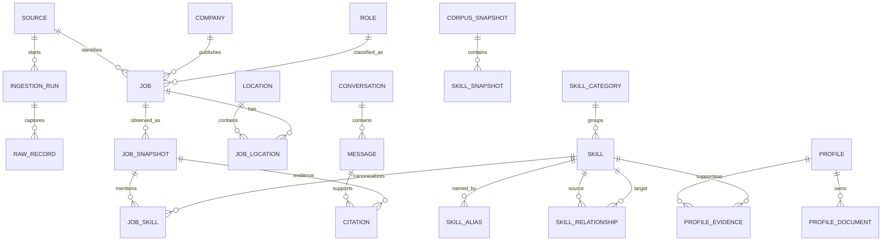
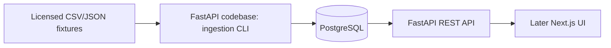
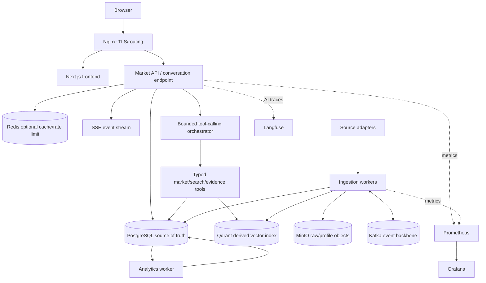

# Tech Market Intelligence — Implementation Plan

Status: approved by project owner for M1 implementation.

## 1. Executive Summary

**Product definition:** Tech Market Intelligence is an evidence-backed platform that turns versioned technical job postings into reproducible skill-demand, role, location, trend, search, and career insights.

**Primary user:** student, early-career technologist, career changer, educator, or analyst deciding what skills and roles merit attention.

**Core problem:** job-market evidence is fragmented, mutable, inconsistently named, difficult to compare over time, and often replaced by unsupported career advice.

**Core differentiator:** deterministic analytics and traceable source evidence form source of truth; models extract, route, retrieve, and explain but never invent authoritative market statistics.

**Delivery strategy:** local-first monorepo; FastAPI modular monolith and PostgreSQL first; Next.js UI after corpus/query foundation; Qdrant, Kafka, Redis, MinIO, Langfuse, Prometheus, and Grafana enter only at measured gates.

### Assumptions requiring approval

1. Initial geography is source-dependent, with Hanoi/remote support after enough representative records exist; no claim of broad market representativeness.
2. English postings are first extraction benchmark; Vietnamese taxonomy/examples follow as a separate evaluated expansion.
3. Anonymous read-only use is enough through core analytics/search; accounts wait for saved conversations/profile data.
4. Full descriptions may be stored locally for research when source permission allows; public demos can expose excerpts and canonical source links instead.
5. Trend periods use `first_observed_at` or reliable publication date, explicitly labeled; collection growth must not be presented as demand growth.
6. PostgreSQL full-text search precedes any vector database. Qdrant remains target specialization, not M0 dependency.
7. Proposed commands and dependency versions become exact only during M0 toolchain selection; planning must not install dependencies.

### Capability map and build order

| Module ID | Responsibility | Depends on |
|---|---|---|
| `platform-foundation` | Monorepo, configuration, quality gates, local PostgreSQL | — |
| `market-corpus` | Sources, raw observations, canonical jobs, provenance | platform-foundation |
| `skill-intelligence` | Taxonomy, aliases, extraction, canonicalization | market-corpus |
| `market-analytics` | Deterministic metrics and snapshots | skill-intelligence |
| `market-experience` | API and UI for browse, trends, comparisons | market-analytics |
| `retrieval` | Lexical, dense, hybrid, reranking evaluation | market-corpus |
| `research-assistant` | Grounded tools, conversation, synthesis | market-analytics, retrieval |
| `profile-intelligence` | Private profile evidence and market comparison | skill-intelligence, market-analytics |
| `event-processing` | Durable async lifecycle and eventual Kafka split | market-corpus |
| `operations` | Evaluation, telemetry, deployment, reliability | all modules |

Build order: foundation → corpus → skills → analytics/experience → retrieval → assistant → optional profile → event processing/operations.

## 2. Product Scope

### Goals

- Quantify requested skills by role, seniority, location, source, and time window.
- Show denominator, sample size, filters, metric version, freshness, and supporting jobs for every statistic.
- Compare roles using observed skill distributions, not stereotypes.
- Search jobs using structured filters first, then benchmarked lexical/semantic retrieval.
- Answer research questions through typed tools over stored data, with fact/interpretation/general-knowledge separation.
- Compare optional user evidence against market requirements without opaque match scores.

### Explicit non-goals

- Applicant tracking, job applications, recruiter CRM, salary negotiation, or job-board monetization.
- LinkedIn scraping or dependence on prohibited/fragile scraping.
- Universal labor-market coverage or causal claims from convenience samples.
- Opaque “82% match” scores, automatic employability ranking, or hiring decisions.
- LLM-generated counts, percentages, rankings, trends, or citations.
- M0 microservices, Kafka, Qdrant, Redis, MinIO, Kubernetes, multi-agent orchestration, authentication, or paid cloud.
- Real-time market claims before source freshness and sampling permit them.

### Trust contract

Every market metric returns: value, numerator, denominator, unit, dimensions, date window, source cutoff, corpus snapshot ID, taxonomy/metric version, coverage warning, and evidence links. Missing or weak samples produce “insufficient evidence,” not confident prose.

## 3. User Workflows

1. **Browse market:** choose role/seniority/location/window → view sample count and top skills → drill into supporting postings and source snapshots.
2. **Explore trends:** select skill and cohort → view period prevalence with denominators and coverage → inspect postings entering each period → compare only compatible snapshot/metric versions.
3. **Compare roles:** choose two roles and shared filters → see common, distinctive, and overlapping skills plus sample adequacy → open evidence sets.
4. **Search jobs:** enter terms/skills and filters → receive paginated lexical results → later switch to semantic/hybrid modes with visible mode and evidence excerpts.
5. **AI research:** ask question → assistant chooses bounded typed tools → deterministic query/retrieval runs → answer labels data facts and interpretation, cites evidence, then proposes follow-ups.
6. **Optional profile:** upload or enter profile → review extracted claims/evidence → compare against selected market cohort → see common missing skills and verified project evidence; delete all profile artifacts on demand.

## 4. Domain Model



### Identity and temporal rules

- `Job`: stable logical posting. Deterministic ID from source namespace + immutable source posting ID; fallback canonical URL hash. Never title/company alone.
- `RawRecord`: immutable fetched/imported payload metadata and content hash.
- `JobSnapshot`: parsed version at observation time; replacement creates snapshot, not overwrite. Tracks parser/normalizer versions.
- Duplicate groups distinguish exact source duplicates, cross-source mirrors, and probable duplicates. Automatic merges require conservative rules; uncertain matches remain reviewable.
- `Role` and `Skill` use stable IDs and versioned taxonomy; labels may evolve without breaking historical facts.
- `JobSkill` stores span, extraction method, confidence, taxonomy version, and reviewed state. Analytics include only configured evidence classes.
- `SkillSnapshot` means published aggregate, not mutable cache.

### Optional profile entities

`User`, `Profile`, `ProfileDocument`, `ProfileSection`, `ProfileSkillEvidence`, `ProfileComparison`, `DeletionRequest`. Profile data belongs to user scope and never enters market aggregates.

## 5. Data Architecture

### PostgreSQL operational tables

- `sources`, `source_checkpoints`, `source_permissions`
- `ingestion_runs`, `raw_records`, `processing_attempts`, `processing_failures`
- `jobs`, `job_snapshots`, `companies`, `roles`, `seniority_levels`, `locations`, `job_locations`
- `skills`, `skill_aliases`, `skill_categories`, `skill_relationships`, `taxonomy_versions`, `job_skills`
- `conversations`, `messages`, `tool_executions`, `citations`
- later: `profiles`, `profile_documents`, `profile_sections`, `profile_skill_evidence`, `deletion_requests`
- async bridge: `work_items`, `outbox_events`, later `consumer_inbox`

### Analytics tables/materialized views

- `metric_definitions`: formula, dimensions, inclusion/exclusion and version.
- `corpus_snapshots`: immutable cutoff and included observation set/hash.
- `skill_statistics`: prevalence/count by skill, role, seniority, location, period, corpus snapshot.
- `role_statistics`: posting counts, skill breadth and stable cohort summaries.
- `skill_cooccurrence_statistics`: pair support, confidence/lift where denominator supports interpretation.
- `skill_trend_statistics`: period prevalence and change with sample warnings.
- `analytics_runs`: parameters, versions, status, input/result hashes.

No aggregate stores only percentage. Numerator and denominator are mandatory. Counts use deduplicated logical jobs and one selected snapshot per cutoff.

### History/snapshot tables

`raw_records`, `job_snapshots`, `corpus_snapshots`, `skill_statistics`, `role_statistics`, `skill_trend_statistics`, `prompt_runs`, and vector index manifests are append-oriented. Corrections publish new versions; prior public results remain addressable.

### Provenance envelope

Each derived fact can resolve:

`metric result → analytics run → corpus snapshot → job snapshot IDs → raw record hash/object → source URL + retrieval timestamp + permission status`.

### Canonical ingestion state machine

`DISCOVERED → RAW_STORED → PARSED → NORMALIZED → SKILLS_EXTRACTED → INDEXED → READY`, with `FAILED_RETRYABLE`, `FAILED_TERMINAL`, `SUPERSEDED`, `DELETED`. Transitions are idempotent and recorded. Retry key combines logical job ID, raw hash, pipeline stage, and processor version.

## 6. Initial Architecture

M0/M1 use one backend deployable with internal modules and CLI entry points. PostgreSQL is only service dependency after foundation setup; raw small fixtures may remain version-controlled, while larger raw artifacts use filesystem through `BlobStore` interface.



Module boundaries: `ingestion`, `catalog`, `taxonomy`, `analytics`, `search`, `assistant`, `profiles`, `platform`. Internal calls are typed Python interfaces; no internal HTTP. Cross-module writes go through owning service. API uses `/api/v1`, paginated list contracts, one structured error envelope, boundary validation, and additive evolution.

## 7. Target Architecture



PostgreSQL remains authority. Qdrant, Redis, and Kafka are rebuildable/derived or transport layers. MinIO becomes authoritative for blobs only with DB metadata, hashes, reconciliation, and coordinated backup.

## 8. Repository Structure

```text
apps/
  api/                 FastAPI composition, HTTP/SSE boundaries
  web/                 Next.js user interface
  worker/              same Python packages, background entry point
packages/
  backend/
    domain/             entities, value objects, policies
    ingestion/          adapters, state machine, parsers
    taxonomy/           skills, aliases, extraction
    analytics/          metric definitions and snapshot builds
    search/             SQL/FTS/vector retrieval adapters
    assistant/          tools, turn context, provider ports
    profiles/           optional private document pipeline
    platform/           config, DB, telemetry, blob/event ports
  contracts/            OpenAPI-derived client/types or schemas
infra/
  compose/              local profiles introduced by milestone
  nginx/
  monitoring/
data/
  fixtures/             small licensed/synthetic inputs
  taxonomy/             reviewed versioned taxonomy seeds
  benchmarks/           labeled, license-safe evaluation sets
  manifests/            dataset provenance/license metadata
scripts/                thin wrappers; production logic stays in packages
migrations/
tests/
  unit/ integration/ contract/ e2e/ evaluation/
docs/
  adr/ architecture/ metrics/ data-sources/ threat-model/
tasks/
  plan.md
  todo.md
```

Notebooks may explore data under `notebooks/`, but reusable parsing/metrics move into packages before milestone completion.

## 9. Data Source Strategy

### Ordered acquisition plan

1. **M1 fixtures:** synthetic and manually curated license-safe CSV/JSON (100–500 records), including duplicates, edits, missing fields, and malformed rows. Proves pipeline, not market claims.
2. **Public licensed historical set:** accept only explicit license, publisher, version, provenance, geography, and collection method. Reject “found on Kaggle/GitHub” without rights metadata.
3. **Official ATS feeds:** selected Greenhouse Job Board and Lever Postings endpoints for current public postings. Poll conservatively, preserve canonical links, employer/source attribution, retrieval time, raw hash, and permission review. APIs expose current postings, so local observations create history.
4. **USAJOBS:** useful structured API and historical federal announcements for pipeline/trend evaluation; analyze as a clearly separate federal cohort, never proxy for private tech market.
5. **Manual import/paste:** fills Hanoi or curated gaps when contributor records source URL, permission basis, observed date, and attribution.
6. **Site-specific adapters/Common Crawl:** research-only after legal/terms review; never foundational.

### Candidate-source assessment

| Source | Permission/terms stance | Limits/stability | Geography/history | Fields/attribution |
|---|---|---|---|---|
| Greenhouse Job Board API | Public GET access; endpoint access is not blanket republication permission, so review employer terms | GET quota undocumented; mature official API; current postings only | Participating employers globally; create history through snapshots | IDs, title, location, description, departments/offices, dates/pay when exposed; retain employer and canonical URL |
| Lever Postings API | Official public postings API; third-party collection is documented, but content rights still require review | Read quota undocumented; `v0` contract merits schema monitoring; current postings only | Participating employers globally, including EU endpoint | ID, title, location, team/department/level, descriptions, workplace/pay when exposed; retain hosted URL |
| USAJOBS Search/Historic APIs | Official public/government API terms; API key needed for search, historical endpoint can be public | Search documents pagination/row limits; stable official interface | US federal market, including overseas roles; useful historic announcements | Agency, occupation, location, salary, dates, requirements, canonical/apply URLs; always label federal cohort |
| Licensed public dataset | Accept only explicit license and provenance; hosting site alone proves no rights | Static and often stale; validate schema/version per dataset | Dataset-specific | Require publisher, version, license, original source, collection dates, and record provenance |
| Manual CSV/JSON/paste | Contributor must attest permission and avoid applicant/personal data | Stable local contract; quality depends on validation | Any supplied cohort/history | Require source name/URL or “user supplied,” permission basis, observed date, batch ID |
| Common Crawl | Original-site rights still apply; not default public-demo corpus | Free archive but costly/fragile extraction and incomplete coverage | Global historical web snapshots | Preserve original URL, crawl ID/date, hash; use only after source-specific review |

Before enabling any network adapter, verify current official documentation and terms, record review date in source registry, and test against captured fixtures. No undocumented rate is treated as unlimited.

### Source registry fields

Owner, adapter type/version, base URL, terms URL/review date, permission status, license, allowed storage/display, attribution, rate policy, geography, fields, publication/history support, checkpoint, freshness target, and takedown contact.

### SourceAdapter contract

- `discover(checkpoint, limit) -> SourceItemPage`
- `fetch(source_item) -> RawArtifact`
- `normalize_source_metadata(raw) -> SourceMetadata`
- `next_checkpoint(page) -> Checkpoint`

Adapters do no canonical domain normalization. Responses are untrusted and schema-validated. Fetch policy supports backoff, jitter, conditional requests, user agent, and per-source caps. Public UI reports cohort/source coverage and observed period. Missing records become closure candidates only after a complete successful enumeration for that source; partial/error runs cannot close jobs. Confirm closure after two complete polls or a source-specific grace period, and trip a circuit breaker/manual review when disappearance rate exceeds a configured baseline. Terms receive review before enablement, at least every six months, and immediately after documented/API behavior change; failed review disables fetching/display according to policy. Source owner handles takedown requests and records resolution.

## 10. Skill Intelligence Design

### Taxonomy

Stable `skill_id`, canonical label, category, status, parent where semantically valid, first/last taxonomy version. Alias has normalized form, locale, matching mode, case sensitivity, boundary rule, ambiguity status, and evidence. Relationships (`IS_VARIANT_OF`, `PART_OF`, `OFTEN_USED_WITH`) must not collapse distinct skills: `AWS EC2` remains child of `AWS`, not merely alias.

### Extraction cascade

1. Unicode/text normalization preserving source offsets.
2. Exact alias dictionary with token boundaries and case rules.
3. Regex/rules for forms such as `.NET`, `C++`, `Node.js`, cloud service families.
4. Ambiguity resolver using local context (`R`, `Go`, `Spark`, `Airflow`). Low-confidence cases become candidates, not facts.
5. Optional LLM structured extraction for residual mentions; output constrained to spans/candidates and validated.
6. Optional embedding-assisted candidate ranking; human/rule acceptance controls canonical mapping.

Dictionary/rules supply high-precision baseline and authoritative aliases. LLM never silently creates canonical skills. New candidates enter review queue with examples and frequency.

### Evaluation

Stratified labeled postings by role, seniority, source, language, formatting, and hard negatives. Report exact-span and canonical-skill precision/recall/F1, alias-level errors, ambiguity confusion, and performance by cohort. Freeze a hidden test set; taxonomy changes trigger regression. Initial gate: dictionary baseline measured before LLM; later candidate must improve macro F1 without unacceptable precision loss or cost.

## 11. Retrieval Design

### Stages

1. **SQL metadata:** explicit role/seniority/location/skill/date filters; deterministic ordering and keyset pagination.
2. **PostgreSQL lexical:** weighted `tsvector` over title, canonical skills, company, and description; benchmark language configuration and phrase behavior.
3. **Dense:** provider-neutral embeddings on title/summary and bounded semantic chunks. Start with pgvector only if operationally small; target Qdrant when specialization gate is met.
4. **Hybrid:** fuse lexical and dense ranks using reciprocal-rank fusion; filters apply before/within retrieval, not after unauthorized retrieval.
5. **Reranking:** cross-encoder or provider model only if labeled benchmark shows meaningful NDCG/MRR gain at acceptable p95/cost.

### Benchmark

Gold set: at least 50 initial queries, growing to 150+, spanning exact technology, conceptual role, constraints, abbreviations, and hard negatives. Each query has graded relevance judgments and filter expectations. Split tuning/test queries. Compare Recall@5/10, Precision@5, MRR, NDCG@10, zero-result rate, p50/p95 latency, index size, build time, and CPU/RAM. Bootstrap confidence intervals; do not declare winner from one average. Before test evaluation, register promotion target; initial default requires ≥0.03 absolute NDCG@10 or ≥10% relative MRR gain without >0.02 Recall@10 loss and with p95 ≤1.5× current default. Reranking uses same gate against hybrid. Log model, dimensions, chunker, index parameters, corpus snapshot, and benchmark version.

### Qdrant introduction gate

Introduce only after dense search proves user value and one persists: pgvector p95 >500 ms on representative load after tuning; roughly 1–5M vectors; vector maintenance harms OLTP; or required filtered hybrid/collection isolation is materially simpler. PostgreSQL IDs and vector-index manifest handle replacement/tombstones/rebuild.

## 12. AI Agent Design

### First tool set

- `search_jobs(query?, roleIds?, seniorityIds?, locationIds?, skillIds?, dateRange?, mode, pageCursor, pageSize)`
- `get_job(jobId, snapshotId?)`
- `get_skill_distribution(cohort, window, limit, corpusSnapshotId?)`
- `get_skill_trend(skillId, cohort, granularity, window)`
- `compare_roles(roleIds[2], cohortFilters, window)`
- `get_skill_cooccurrence(skillId, cohort, minSupport, limit)`
- `get_location_statistics(cohort, window)`
- `retrieve_job_evidence(jobSnapshotIds, passagesPerJob)`

Every output includes provenance, denominator where applicable, warnings, bounded rows, and continuation cursor. Agent cannot issue arbitrary SQL.

### Turn lifecycle

1. Persist user message and create turn/trace ID.
2. Classify request and establish budget.
3. Orchestrator receives current request, bounded relevant history, current transcript, previous tool results, and available schemas.
4. Validate and execute at most three tool rounds by default; cap tool calls, wall time, rows, and tokens.
5. Turn context keys tool calls by canonical tool name + normalized arguments + corpus snapshot; identical calls reuse same-turn result.
6. Main agent synthesizes only returned evidence, labels **Data fact**, **Interpretation**, and **General knowledge**, and emits citation IDs.
7. Output validator verifies citation IDs exist, statistic values match tool output, and unsupported numeric claims are rejected/regenerated.
8. Stream status/tool/answer/completion events through SSE.
9. Generate suggestions after final answer, using completed answer/context; suggestions may be omitted on failure/budget.

### History and streaming

PostgreSQL stores conversations/messages/tool executions; summaries are versioned and never replace source messages. SSE wins initially: server-to-client stream, HTTP commands, browser reconnect, simpler proxying. Event IDs support deduplication and `Last-Event-ID`; normal GET recovers durable state. WebSocket requires measured duplex need such as collaborative sessions or frequent control frames.

### Multi-agent gate

Keep one orchestrator plus deterministic tools and one synthesis step. Specialized agents become justified only when evaluation shows persistent tool-selection/context interference that separate prompts improve, or independently owned domains require isolation. Added architecture must beat baseline on tool accuracy, groundedness, latency, and cost.

## 13. Prompt Strategy and Prompt Repetition Experiments

Reference: Leviathan, Kalman, Matias, “Prompt Repetition Improves Non-Reasoning LLMs,” arXiv:2512.14982v1. Paper motivates hypothesis; project must reproduce domain results.

### Good candidates

Bounded, schema-constrained, low-reasoning tasks: role classification, seniority classification, location normalization, residual skill extraction, canonical candidate selection, document-type classification, metadata extraction, query intent, and tool routing.

### Poor candidates

Long job descriptions/RAG contexts where doubled prefill dominates; multi-document market synthesis; planning/tool loops; chain-of-thought/reasoning-enabled tasks; token-limit-near prompts; streaming answer generation. Partial repetition is a distinct project experiment, not paper replication.

### Experimental protocol

- Freeze prompt content, examples, schema, provider/model revision, decoding, and test set.
- Strategies: `baseline` (full query once), `repeat_x2`, `repeat_x3`, and task-specific `reasoning` where available.
- Repeat entire effective input for faithful repetition condition. Keep system/safety handling documented according to provider constraints.
- Use paired examples and bootstrap confidence intervals; McNemar for paired classification correctness where suitable.
- Extraction: canonical precision/recall/F1, schema validity, omission/hallucination rate.
- Classification/routing: accuracy, macro F1, per-class metrics, tool/argument accuracy, unnecessary-tool rate.
- Operations: input/output tokens, p50/p95 latency, failures, local RAM/CPU, estimated cost.
- Test short/medium/long prompt strata separately. Set maximum input threshold; no production repetition beyond it without explicit result.
- Before running each benchmark, register task-specific promotion threshold. Starting default for classification/extraction: statistically supported ≥1.0 absolute macro-F1 point or ≥20% error reduction, with no protected/cohort slice losing >2 points and p95 latency/input tokens ≤2× baseline. Tool routing additionally cannot increase unnecessary-tool rate. Threshold may change only before viewing test results. Otherwise baseline stays default.

### Prompt registry/run record

`prompt_name`, semantic `prompt_version`, template hash, task, strategy, model/provider/revision, reasoning flag, temperature/seed where supported, benchmark/corpus/taxonomy version, input/output tokens, latency, result, schema validity, evaluator versions, trace ID. Any template or examples change increments version. Strategy selected by configuration, never string duplication scattered through business logic.

Langfuse later records trace/span IDs, prompt metadata, tool calls, retrieval set, costs, errors, and scores. Benchmark records remain exportable and runnable without Langfuse.

## 14. Evaluation Strategy

| Area | Dataset/check | Metrics/gates |
|---|---|---|
| Ingestion | fixtures with malformed rows, exact/near duplicates, edits, retries | parse success, field accuracy, duplicate decisions, same input/version yields no duplicate logical job, retry recovery |
| Role/seniority | human-labeled stratified jobs | accuracy, macro F1, per-class precision/recall, abstention coverage |
| Skills | span + canonical labels and hard negatives | precision, recall, F1, schema validity, ambiguity errors |
| Analytics | tiny hand-calculated golden corpus | exact numerator/denominator, cutoff behavior, late arrivals, taxonomy versions, reproducible hashes |
| Retrieval | graded query-document judgments | Recall@5/10, Precision@5, MRR, NDCG@10, latency, zero results |
| Tools | natural-language question → expected tool + arguments | selection accuracy, argument accuracy, unnecessary calls, repeated-call avoidance |
| Answers | question + fixed tool evidence | citation entailment/coverage, unsupported numeric claims, groundedness, relevance, fact/interpretation separation |
| Prompts | paired held-out examples | task quality plus token/latency/cost by strategy |

Deterministic validators check cited IDs and numbers. Human rubric reviews ambiguous relevance and synthesis. LLM judge may supplement but never be sole gate. RAGAS can be an exploratory comparator after custom ground-truth checks exist.

Release regression artifacts include dataset manifest/license, annotation guidelines, adjudication, version, model/index config, raw predictions, and report. Production feedback cannot silently become test labels.

## 15. LLM and Embedding Provider Plan

Define ports:

- `LLMProvider.generate(request: GenerationRequest) -> GenerationResult`
- `LLMProvider.generate_structured(request, schema) -> StructuredResult`
- `EmbeddingProvider.embed_documents(texts, model_ref) -> EmbeddingBatch`
- `EmbeddingProvider.embed_query(text, model_ref) -> Vector`

Request declares capability needs, not vendor names: structured output, reasoning allowed, max context, privacy mode, timeout, budget. Adapters may support local OpenAI-compatible endpoints, Gemini free tier, and future paid providers. Provider errors normalize into retryable/rate-limit/invalid-request/model-unavailable categories. Secrets stay in environment/secret store and never traces.

Default development path: deterministic/rule baseline first; local model if hardware permits; opt-in free provider only for experiments. No feature requires paid inference. Embedding candidates are benchmarked for retrieval quality, dimensions/storage, CPU/RAM, multilingual behavior, and latency. Index manifest pins model revision, dimensions, normalization, chunker, and corpus snapshot; mixed vectors are forbidden.

## 16. Observability

### Staged introduction

- **M1–M4:** structured logs, correlation/ingestion IDs, health/readiness, timing captured in benchmark outputs. M0 only defines logging/health contracts because no runtime exists. No monitoring stack without workload.
- **M5 assistant:** add Langfuse behind optional adapter because prompt/tool/retrieval traces now exist. Local/no-op mode mandatory; redact descriptions/profile text and secrets.
- **M8 async:** add Prometheus metrics because worker duration, failures, queue lag, retries, API/search latency, DB pool, and embedding latency become operationally meaningful.
- **M9 deployment:** add Grafana dashboards and alerts from established SLOs; not decorative empty dashboards.

Core metrics: HTTP RED metrics with bounded route labels; ingestion stage duration/error/retry; queue oldest-age and depth; analytics freshness/run status; search mode latency/result count; embedding batch duration/failures; tool count/error/cache reuse; SSE active connections/disconnects. Never put job ID, user ID, skill string, URL, or trace ID in metric labels.

Suggested initial SLOs after measurement: local API p95 under 500 ms for cached/materialized analytics and under 1 s search; analytics freshness declared by source; zero unsupported numeric claims on fixed answer regression set. Targets must be revised from baseline, not hidden.

## 17. Security and Privacy

- Validate all API/import/provider boundaries with size, schema, encoding, and field limits.
- Treat job text, retrieved chunks, source metadata, and profile documents as untrusted data; delimit as evidence and state they cannot modify instructions or tool policy.
- Tools enforce authorization and allowed queries server-side; agent never owns authorization.
- Imports use allowlisted formats. Profile milestone verifies extension, MIME and magic bytes, maximum size/page count, archive/compression limits, parser timeout, isolated least-privilege processing, and malware scan where practical.
- Never execute macros, embedded scripts, links, or document payloads. Convert to text in constrained worker.
- Store secrets outside repository; startup validates presence without printing values. Logs/traces redact API keys, emails, phone numbers, profile text, query parameters, and raw provider payloads.
- Public endpoints receive body/page/time limits and rate limits. Redis-backed distributed limits wait for multi-instance deployment; local limits suffice earlier.
- Profile files private by default, encrypted in transit, access-controlled, excluded from training/analytics, and retention-disclosed. Online deletion removes DB/blob/vector/cache copies within a defined SLA and records tombstones. Backups use finite documented retention; restore procedure reapplies deletion tombstones before service exposure. If envelope encryption is adopted, destroying per-user keys provides cryptographic deletion; otherwise UI must disclose backup expiry rather than promise immediate backup erasure.
- Evidence display sanitizes HTML; UI never renders source HTML directly.
- Dependency scanning, lockfiles, least-privilege DB roles, CORS/CSRF/security headers, backup/restore tests, and threat model enter before public profile demo.

## 18. Local and Cloud Deployment

### Local first

M0 development can run backend tooling directly plus PostgreSQL. Docker Compose then gains profiles incrementally: `core` (PostgreSQL/API/web), `search` (Qdrant only when accepted), `ai-observability` (Langfuse dependencies), `events` (Kafka), `monitoring` (Prometheus/Grafana), `objects` (MinIO). Resource-heavy profiles stay optional. Seed command imports license-safe demo corpus. One documented reset, backup, restore, and health workflow is required before public demo.

### Free-tier public demo

Deploy static/server-rendered web and small API/database only where free quotas fit; use a read-only curated snapshot and precomputed analytics. Disable expensive ingestion/profile/model calls or require local execution. Show freshness and sample limitations. Keep provider-neutral container images and database backup so host can change. Paid cloud, managed Kafka/vector DB, and persistent GPU are not requirements.

## 19. Incremental Architecture Path

| Point | Shape | Why component appears |
|---|---|---|
| M0 | monorepo skeleton, contracts/docs, PostgreSQL plan; no running infra yet | establish boundaries and quality contract |
| M1 | modular FastAPI backend + PostgreSQL + CLI/file adapters; synchronous bounded jobs | corpus ingestion needs transactions/provenance; one process remains enough |
| M2 | same modular backend and PostgreSQL, now with versioned taxonomy/classification modules and evaluation harness; still one deployable | normalization needs stable evidence/version contracts, not a new service |
| M5 | Next.js + FastAPI + PostgreSQL + FTS/optional vector adapter + one orchestrator + SSE + optional Langfuse | user-facing research and retrieval now create real streaming/tracing need |
| Final | Nginx, web, API, workers, PostgreSQL, evaluated Qdrant; optional MinIO/Redis/Kafka and monitoring profiles | each specialization introduced only by measured scale, shared storage, replay, cache, or operations signal |

## 20. Milestone Roadmap

Commands below are target conventions to establish in M0, not commands run during planning: `make format-check`, `make lint`, `make typecheck`, `make test`, `make test-integration`, `make test-evaluation`, `make build`, `make compose-config`. Exact underlying tools/versions require M0 ADR and lockfiles. During M0, `build` covers only selected minimal API/web scaffolds and contract packages; smoke tests prove process/module startup and one health/render path, not product behavior. Benchmark environment must record CPU, RAM, OS, corpus/vector count, concurrency, warm/cold state, and run count; initial reference is one 4-core/16-GB developer machine, then revised from actual user hardware. Human project owner is approver; approval/rejection/deferment is recorded in ADR status and checklist with date and rationale.

### M0 — Foundation and executable contracts

- **Objective/result:** reviewed architecture, monorepo skeleton, quality commands, API/data contracts; no market claim yet.
- **Scope/services:** select supported Python/Node versions, packaging, FastAPI/Next.js test stacks, config conventions, PostgreSQL migration tool, CI design. Define OpenAPI error/pagination/provenance envelopes and metric glossary.
- **Likely paths:** `apps/`, `packages/`, `tests/`, `docs/architecture/`, `docs/metrics/`, `docs/adr/`, root task runner/config.
- **DB:** initial migration conventions and schema namespaces; minimal source/job/snapshot migration deferred to M1.
- **Tests/evaluation:** smoke/unit examples, contract schema validation, secret/config failure tests.
- **Verify:** all target quality commands available and clean; fresh-clone setup documented; no secret committed.
- **Done:** capability boundaries approved, ADR-001/002 accepted, CI plan and Definition of Done explicit.
- **Non-goals:** ingestion implementation, UI, LLM, Docker service zoo.
- **Risks:** toolchain churn and premature abstractions; mitigate with minimal ports and pinned versions.

### M1 — Canonical corpus ingestion

- **Objective/result:** user can import curated CSV/JSON and inspect canonical jobs with provenance.
- **Scope/services:** in-process `FileAdapter`, raw record hashing, deterministic IDs, snapshots, state machine, exact dedup, validation report, CLI; backend remains one codebase.
- **Paths:** `packages/backend/ingestion`, `domain`, `platform/db`, `data/fixtures`, `migrations`, ingestion tests.
- **DB:** sources, permissions, runs, raw records, jobs, snapshots, companies, locations, failures.
- **Tests:** golden parsing; malformed/oversized rows; same import twice; changed posting creates snapshot; retry and partial failure; provenance traversal.
- **Benchmark:** throughput and peak memory on 1k/10k fixture copies; report only, no premature target.
- **Verify:** `make lint typecheck test test-integration`; import twice and compare counts/hashes.
- **Done:** zero duplicate logical jobs on replay, all accepted rows trace to source/raw hash, failures resumable.
- **Non-goals:** web scraping, Kafka, embeddings, analytics claims.
- **Risks:** bad IDs and licensing; require source namespace and manifest before import.

### M2 — Skill, role, seniority, and location normalization

- **Objective/result:** imported jobs expose inspectable normalized role/location/seniority and canonical skill evidence.
- **Scope/services:** versioned taxonomy, aliases/rules, span evidence, deterministic baselines, review/abstain status; optional offline model experiment only after labels.
- **Paths:** `packages/backend/taxonomy`, `data/taxonomy`, `data/benchmarks/extraction`, evaluation tests.
- **DB:** roles, seniority levels, taxonomy versions, skills, aliases, categories, relationships, job skills, classification records.
- **Tests:** alias boundaries, punctuation/case, ambiguous terms, parent/child behavior, taxonomy migration, repeatability.
- **Benchmark:** labeled role/seniority/location/skill sets; macro F1 and extraction precision/recall/F1 by cohort.
- **Verify:** quality commands plus `make test-evaluation`; generate versioned baseline report.
- **Done:** taxonomy inspectable; every extracted skill has span/method/version; baseline metrics published; uncertain mappings abstain.
- **Non-goals:** production LLM extraction, trend analytics, vector search.
- **Risks:** taxonomy drift/false positives; freeze versions and hard-negative suite.

### M3 — Deterministic market analytics and first useful UI

- **Objective/result:** browse top skills, sample sizes, role comparison, and supporting jobs from selected cohort.
- **Scope/services:** metric registry, corpus snapshots, materialized aggregates, FastAPI read endpoints, minimal Next.js dashboard/job explorer.
- **Paths:** `analytics`, `apps/api`, `apps/web`, `packages/contracts`, `docs/metrics`.
- **DB:** corpus/analytics runs, metric definitions, skill/role/cooccurrence snapshots and indexes.
- **Tests:** hand-calculated golden corpus; denominator/filter/cutoff/null/tie/late-arrival behavior; API contracts; UI accessible states and empty/error states.
- **Benchmark:** query plans and p50/p95 for representative filters; sample adequacy warnings.
- **Verify:** all quality/build commands; API/UI end-to-end drill-down from statistic to evidence.
- **Done:** no percentage without numerator/denominator/snapshot; exact golden outputs; usable local demo.
- **Non-goals:** “real-time” trends, AI chat, profiles.
- **Risks:** misleading convenience sample; prominent source/geography/time coverage.

### M4 — Search and retrieval evaluation

- **Objective/result:** users search/filter jobs; project provides evidence whether lexical, dense, hybrid, or reranked retrieval helps.
- **Scope/services:** SQL filters, PostgreSQL FTS, gold relevance set; provider-neutral embedding/index adapter; dense/hybrid experiments; reranker experiment last.
- **Paths:** `search`, `data/benchmarks/retrieval`, API/web search, evaluation reports.
- **DB:** search vectors/config, embedding/index manifests; Qdrant only if gate accepted.
- **Tests:** filters, pagination, stable ranking, replacement/tombstone, authorization-ready filtering, malformed query.
- **Benchmark:** Recall@5/10, Precision@5, MRR, NDCG@10, latency/RAM/index/build cost with held-out set.
- **Verify:** evaluation + integration + build; reproduce report from manifest.
- **Done:** one default mode selected by evidence; UI identifies mode; all results link to jobs/evidence.
- **Non-goals:** claim semantic superiority, second search engine without gate.
- **Risks:** weak labels and embedding drift; adjudication and pinned manifests.

### M5 — Grounded AI research assistant

- **Objective/result:** ask market question and receive streamed, cited answer backed by deterministic tools.
- **Scope/services:** provider ports, first tools, conversation/history, turn context/cache, three-round default tool loop, citation validator, SSE, post-answer suggestions, optional Langfuse.
- **Paths:** `assistant`, API chat routes/SSE, web research UI, tool/answer benchmarks.
- **DB:** conversations, messages, tool executions, citations, prompt registry/runs.
- **Tests:** tool schemas, budgets, repeated calls, timeout, injection fixtures, citation/numeric validator, reconnect/dedup, provider failure.
- **Benchmark:** tool/argument accuracy, unnecessary calls, groundedness, unsupported claims, latency/token use across providers.
- **Verify:** fixed questions replay against frozen corpus; zero unsupported numeric claims; citations resolve.
- **Done:** facts distinguish interpretation; no direct agent SQL; no paid provider required.
- **Non-goals:** multi-agent system, autonomous writes, general career chatbot.
- **Risks:** injection and fake citations; server policy plus deterministic output checks.

### M6 — Trends, live source adapters, and prompt experiments

- **Objective/result:** supported sources refresh incrementally; users inspect honest trends; benchmark report tests prompt repetition.
- **Scope/services:** one official ATS adapter first, checkpoints/conditional fetch/backoff, temporal snapshots, trend metrics, baseline/repeat_x2/repeat_x3/reasoning harness.
- **Paths:** source adapters, trend analytics/UI, `data/benchmarks/prompts`, evaluation reports.
- **DB:** checkpoints, source fetch metadata, trend snapshots, prompt run metadata.
- **Tests:** mocked API schema changes/rate errors, checkpoint restart, replacement/closure, trend cohort stability, paired prompt runs.
- **Benchmark:** source throughput/freshness; trend confidence/sample size; task quality/token/p50/p95 by prompt strategy and length.
- **Verify:** replay captured fixtures without network; prompt reports reproducible; terms review current.
- **Done:** trend wording states date basis/coverage; prompt policy based on project result, not paper alone.
- **Non-goals:** broad scraping, automatic x2 in production, Kafka.
- **Risks:** terms/API drift and collection-bias trends; registry reviews and fixed-cohort analyses.

### M7 — Optional private profile comparison

- **Objective/result:** user uploads/reviews profile and sees evidence-based gaps against chosen market cohort, then deletes data.
- **Scope/services:** authentication/minimal ownership, filesystem `BlobStore` first, safe PDF/DOCX/TXT/MD extraction, evidence review, deterministic comparison, deletion workflow.
- **Paths:** `profiles`, upload API/UI, security tests, threat model.
- **DB:** users/sessions as selected, profiles/documents/sections/evidence/comparisons/deletions.
- **Tests:** MIME/magic mismatch, oversized/decompression bomb fixtures, parser timeout, tenant isolation, evidence links, complete deletion and failed-delete recovery.
- **Benchmark:** parse success and profile skill precision/recall on consented/synthetic set; no generic score.
- **Verify:** security/integration/e2e plus deletion reconciliation.
- **Done:** comparison shows market denominator and profile evidence/absence; private data excluded from traces/analytics.
- **Non-goals:** hiring recommendation, persistent public resumes, OCR unless evaluated need.
- **Risks:** sensitive-data leakage; minimize retention and disable feature in public demo by default.

### M8 — Durable asynchronous processing and event decision

- **Objective/result:** long ingestion/embedding/analytics survives restart and exposes status.
- **Scope/services:** worker process, PostgreSQL work queue + `FOR UPDATE SKIP LOCKED`, transactional outbox, idempotent handlers, SSE status. Benchmark before Kafka.
- **Paths:** `apps/worker`, platform work/events, operational runbooks.
- **DB:** work items, attempts, outbox, inbox/idempotency keys, event history.
- **Tests:** crash before/after side effect, duplicate delivery, poison item, retry/backoff, concurrent workers, replay, shutdown.
- **Benchmark:** throughput, queue age, DB bloat/CPU, 1/2/4 workers. Kafka accepted only for replay/multiple consumers/lag/scale signal.
- **Verify:** kill/restart test; no duplicate published job/vector; queue drains.
- **Done:** durable processing meets freshness target; ADR records keep PostgreSQL queue or introduce Kafka.
- **Non-goals:** Kafka for CV value, “exactly once” claims.
- **Risks:** dual writes and retry duplication; outbox/inbox and stable event IDs.

### M9 — Operations, hardening, and portfolio deployment

- **Objective/result:** reproducible public demo with evaluated claims, health visibility, backup/restore, and architecture narrative.
- **Scope/services:** optional MinIO/Redis/Qdrant/Kafka only from accepted gates; Prometheus, Grafana dashboards, Nginx, CI, read-only demo snapshot, runbooks.
- **Paths:** `infra`, monitoring, CI, deployment docs, ADRs, evaluation cards.
- **DB:** performance indexes/retention; no schema change solely for dashboard cosmetics.
- **Tests:** full e2e, load/smoke, restore, dependency/security scan, authorization, failure drills.
- **Benchmark:** API/search/stream SLOs, resource envelope on student hardware, cold start, restore time, telemetry overhead.
- **Verify:** `make ci`; clean-machine Compose smoke; backup/restore and rollback drill; public links/citations work.
- **Done:** core profile runs locally near $0; demo degrades safely without LLM; dashboards answer defined operational questions.
- **Non-goals:** paid HA, Kubernetes, global scale.
- **Risks:** free-tier sleep/quota and overbuilt stack; precomputed read-only fallback and optional profiles.

## 21. ADR Roadmap

1. ADR-001 modular monolith and extraction criteria.
2. ADR-002 PostgreSQL as operational/initial analytics source of truth.
3. ADR-003 canonical IDs, deduplication, temporal snapshots, correction policy.
4. ADR-004 source acceptance/licensing and raw-content retention.
5. ADR-005 taxonomy versioning and extraction authority.
6. ADR-006 metric semantics, corpus snapshots, representativeness language.
7. ADR-007 lexical baseline and embedding/provider selection.
8. ADR-008 Qdrant introduction or rejection after benchmark.
9. ADR-009 LLM/embedding provider abstraction and zero-cost fallback.
10. ADR-010 agent tool boundaries, grounding, and maximum tool loop.
11. ADR-011 SSE versus WebSocket.
12. ADR-012 prompt repetition experiment and production policy.
13. ADR-013 profile privacy, retention, deletion, and blob storage.
14. ADR-014 PostgreSQL queue/outbox and Kafka introduction gate.
15. ADR-015 Redis cache/rate-limit gate.
16. ADR-016 MinIO introduction and DB/object consistency.
17. ADR-017 observability data redaction and retention.
18. ADR-018 public demo deployment and degraded mode.

## 22. Risks and Over-Engineering Guardrails

| Risk/technology | Wait until | Concrete signal |
|---|---|---|
| Microservices | after modular monolith | independent scaling/release/ownership/fault isolation is measured; internal boundary already stable |
| Qdrant | after lexical+dense benchmark | pgvector/PG p95 >500 ms after tuning, 1–5M vectors, OLTP interference, or required filtered hybrid isolation |
| Kafka | after durable PG queue | repeated lag beyond freshness target, hundreds–thousands events/s, DB queue pressure, or 3+ replaying consumers |
| Redis | after measured hot reads/multi-instance | repeated reads consume 20–30% DB capacity with likely >80% cache hit, or coordinated rate limiting required |
| MinIO | after filesystem adapter | multi-node shared blobs, roughly 100 GB+, presigned/object lifecycle need, or DB/blob backups exceed objective |
| Grafana | after stable metrics/SLOs | operators have concrete latency, lag, error, freshness questions |
| Multi-agent | after single-agent benchmark | isolated prompts demonstrably improve tool/grounding metrics enough to pay latency/cost |
| Reranker | after hybrid baseline | statistically/practically useful NDCG/MRR lift at accepted p95/resource cost |
| Separate OLAP store | after PostgreSQL tuning | analytics p95 >2 s plus CPU/contention/scale pressure on representative load |

M0 should not contain frontend product code, Qdrant, Kafka, Redis, MinIO, Langfuse, Prometheus, Grafana, Nginx, auth, model calls, profiles, microservices, Kubernetes, or cloud setup. One backend codebase can contain ingestion, taxonomy, analytics, search, and assistant modules through M6; API and worker may be separate processes from same artifact without becoming services.

### Top project risks

1. **Representativeness:** source mix biases conclusions. Mitigation: cohort labels, coverage dashboard, denominators, no universal claims.
2. **Historical distortion:** first observed date differs from publication date. Mitigation: preserve both, label trend basis, fixed-source cohorts.
3. **Taxonomy/metric drift:** updated rules rewrite history. Mitigation: immutable versions and republished snapshots.
4. **Rights/terms:** public endpoint does not imply redistribution permission. Mitigation: source registry, permission review, excerpts/links, takedown.
5. **Cross-store inconsistency:** DB/vector/blob/event disagree. Mitigation: PostgreSQL authority, manifests, outbox, tombstones, reconciliation.
6. **LLM authority creep:** plausible output becomes statistic. Mitigation: typed tools and deterministic numeric/citation validator.
7. **Student hardware:** full stack consumes too much RAM. Mitigation: optional Compose profiles and staged components.
8. **Benchmark leakage/weak labels:** optimistic results. Mitigation: hidden test split, adjudication, versioned manifests.

## 23. Recommended First Implementation Task

After plan approval, execute **M0 Task 1: establish project engineering contract and minimal monorepo skeleton**.

Exact scope:

1. Record approved capability map and create ADR-001 (modular monolith) and ADR-002 (PostgreSQL).
2. Pin supported Python and Node versions; choose package, migration, lint, type-check, and test tools.
3. Create directory skeleton from section 8 without feature code.
4. Define root quality commands (`format-check`, `lint`, `typecheck`, `test`, `build`) and minimal CI plan.
5. Define configuration/secrets policy, structured error envelope, pagination contract, provenance envelope, and Definition of Done.
6. Add one minimal smoke test per selected application scaffold only after toolchain approval.

Acceptance: fresh clone can run documented quality commands; no market feature, dependency service, model call, cloud resource, or secret exists. Stop for review before M1.
